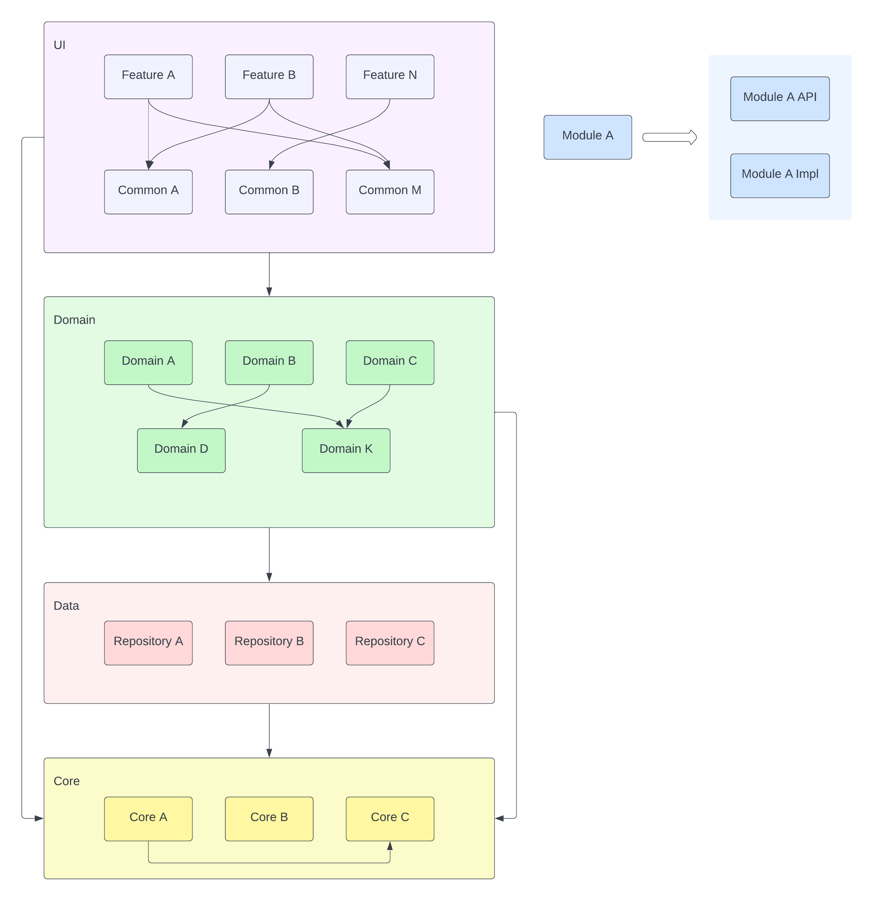

# Weather-Sample

## Introduction
Weather Sample is a simple weather app showcasing some of the material principles.

The app is multi-module, written in Kotlin using Jetpack Compose for the UI. The app consists of 3 screens, a city search screen, a weather screen for a specific city split into current weather and forecast, and a carousel of favorite cities displaying current weather and forecast for each city.

## Getting set up
1. Clone the project
    ```
    $ git clone git@github.com:fvilarino/Weather-Sample.git
    ```
2. Obtain a key from [RapidApi](https://rapidapi.com/) for both the [Geo Cities](https://rapidapi.com/wirefreethought/api/geodb-cities) and the [Open Weather Map](https://rapidapi.com/community/api/open-weather-map)
3. Create a file named `keys.properties` inside the `certs` folder with your key, following this format
    ```
    rapid_api_key=<your key here>
    ```
4. Create a file named `release.properties` inside the `certs` folder with the release signing credentials, following this format
    ```
    store=./certs/release.keystore.jks (use your own release keystore here)
    alias=<you alias>
    storePass=<your store password>
    keyPass=<your key password>
    ```
5. Build the project, using the following command
    ```
    $ ./gradlew assembleDebug -PbuildNumber=1
    ```

## Deeplinks
The app can be opened to the weather and favorite screens via deeplinks, using these schemas

* weather: `weatherapp://weather/<city>/<country code>` (e.g. `weatherapp://weather/vancouver/ca`)
* favorites: `weatherapp://favorite`

This can be exercised with this ADB command (note that the package name for debug builds ends in `.dev`):

    $ adb shell am start -W -a android.intent.action.VIEW -d "weatherapp://weather/vancouver/ca" com.francescsoftware.weathersample

## Architecture
The app is split into 4 layers:

* [UI](./ui) - This is the feature Layer that the user interacts with. This layer is split into 2 sections, a [Feature](./ui/feature) layer that contains each app feature, and a [Shared](./ui/shared) layer containing a set of ui specific utilities to be used by the features.

* [Domain](./domain) - This is the business logic layer that is shared by all features.

* [Data](./data) - This layer contains the repositories providing the data to the app. This layer only contains repositories, on a more complex app we would also include a 2nd `Data Source` layer that feeds the repositories, but that additional complexity is not warranted in such a small app.

* [Core](./core) - This layer contains foundational components that support all other modules in the app.

The dependencies on these layers must always point down - the `UI` modules depend only on `Domain` modules; `Domain` modules depend only on `Data` modules or other `Domain` modules, `Core`, being a foundational layer, can have no external dependencies, while all other layers (`UI`, `Domain`, `Data`) can depend on `Core`.

Within a layer modules are split into a public API module and a private implementation module. Only the API module is visible to other modules; this helps avoid cyclic dependencies that would be incurred if implementation modules depended on other implementation modules. At the same time, this split between `Api` and `Impl` improves build performance as changes to implementation details do not affect any other modules.




## Tech stack:

* Kotlin
* Coroutines & Flows
* Dependency Injection (Dagger + Anvil)
* Retrofit
* Room
* Jetpack Compose
* AAC Viewmodels
* AAC Navigation
* MVI

https://github.com/fvilarino/Weather-Sample/assets/2680481/7eaad42f-a42d-4ef9-b2dc-6ac41671099c

## License

    Licensed under the Apache License, Version 2.0 (the "License");
    you may not use this file except in compliance with the License.
    You may obtain a copy of the License at

       http://www.apache.org/licenses/LICENSE-2.0

    Unless required by applicable law or agreed to in writing, software
    distributed under the License is distributed on an "AS IS" BASIS,
    WITHOUT WARRANTIES OR CONDITIONS OF ANY KIND, either express or implied.
    See the License for the specific language governing permissions and
    limitations under the License.
